# CSCE 435 Group project

## 1. Group members:
1. Will Thompson
2. Kirthivel Ramesh
3. Sofia Ortega
4. Sriabhinandan Venkatarama

The team will be communicating primarily through **Discord**. 


---

## 2. Project topic

Sorting Algorithms

### 2. Brief project description 

We will be comparing the performance of the following algorithms with a variety of differing array inputs. These array input will either be sorted, reversed, or randomly selected values. We will also be measuring how well each algorithm scales. We plan to implement each algorithm using MPI to serve the data amongst multiple GPUs that will then use CUDA. Once each part gets sorted on the GPUs, they will be merged either sequentially or in parallel.

- __Parallel Radix Sort (MPI + CUDA)__

  Note: Radix sort only works with integers

  Pseudo-code: [Source](https://cs.stackexchange.com/questions/6871/how-does-the-parallel-radix-sort-work)
  
```
parallel_for part in 0..K-1
  for i in indexes(part)
    bucket = compute_bucket(a[i])
    Cnt[part][bucket]++

base = 0
for bucket in 0..R-1
  for part in 0..K-1
    Cnt[part][bucket] += base
    base = Cnt[part][bucket]

parallel_for part in 0..K-1
  for i in indexes(part)
    bucket = compute_bucket(a[i])
    out[Cnt[part][bucket]++] = a[i]
```
  
- Odd-Even Transposition Sort (MPI + CUDA)
  
  Pseudo-code: [Source](https://ethz.ch/content/dam/ethz/special-interest/infk/chair-program-method/pm/documents/Verify%20This/challenge3.pdf)

```
process ODD-EVEN-PAR(n, id, myvalue)
 // n … the length of the array to sort
 // id … processors label (0 .. n-1)
 // myvalue … the value in this process
begin
 for i := 0 to n-1 do
 begin
   // alternate between left and right partner
   if i+id is even then
     if id has a right neighbour
       sendToRight(myvalue);
       othervalue = receiveFromRight();
       myvalue = min(myvalue, othervalue);
     else
       if id has a left neighbour
         sendToLeft(myvalue);
         othervalue = receiveFromLeft();
         myvalue = max(myvalue, othervalue);
  end for
end ODD-EVEN-PAR

for i := 0 to array.length-1
 process[i] := new ODD-EVEN-PAR(n, i, array[i])
end for

start processes and wait for them to finish

for i := 0 to array.length-1
 array[i] := process[i].myvalue
end for
```

- Parallel Merge Sort (MPI + CUDA)
  
  Pseudo-code: [Source](https://en.wikipedia.org/wiki/Merge_sort)

```
// Sort elements lo through hi (exclusive) of array A.
algorithm mergesort(A, lo, hi) is
if lo+1 < hi then  // Two or more elements.
mid := ⌊(lo + hi) / 2⌋
fork mergesort(A, lo, mid)
mergesort(A, mid, hi)
join
merge(A, lo, mid, hi)
```
  
- Parallel Quick Sort (MPI + CUDA)
  
  Pseudo-code: [Source](https://www3.cs.stonybrook.edu/~rezaul/Spring-2019/CSE613/CSE613-lecture-8.pdf)

```
partition(A[q : r], x):
  n = r - q + 1
  if n==1 return q

  array B[0: n-1], lessthan[0: n-1], greaterthan[0: n-1]
  parallel for i = 0 to n -1:
      B[i] = A[q + i]
      if B[i] < x then lessthan[i] = 1 else lessthan[i] = 0
      if B[i] > x then greaterthan[i] = 1 else greaterthan[i] = 0
  lessthan[0: n-1] = prefixsum(lessthan[0: n-1])
  greaterthan[0: n-1] = prefixsum(greaterthan[0: n-1])
  k = q + lessthan[n-1], A[k] = x
  parallel for i = 0 to n -1:
      if B[i] < x then A[q + lessthan[i] - 1] = B[i]
      else if B[i] > x then A[k + greaterthan[i]] = B[i]
  return k
  
quicksort(A[q : r]):
  select random element x from A[q : r]
  k = partition(A[q : r], x)
  fork quicksort(A[q : k - 1])
  quicksort(A[k + 1 : r])
  sync

where each quicksort call and each partition call are done in parallel.
```


# Algorithm Documentation

## Radix Sort


### MPI

#### Summary

Implemented Radix Sort with MPI. 
We initialize the array with `inputgen.cpp` to generate the input in parallel.
Each MPI process receives a sub array of the input to sort independently. 
Throughout the runtime, the MPI processes communicate the counts and elements between each other in order for each process to know where to correctly place their own elements in relation to the entire array. 


#### Running

1. Run `. build.sh`

2. Run sbatch:

```
sbatch radix.grace_job  <t> <n>
```

- `t`: number of threads 
- `n`: length of array you want to sort 

#### Adapted From 


* Source Code: https://github.com/jackfly/radix-sort-cuda/tree/master
 * Author: Jack Liu
 * Date: December 18, 2017

### CUDA

#### Summary

This MPI implementation was created with CUDA. 
In this implementation of radix, multiple passes are done on the array.
For each pass, we separate the array between blocks, which performs radix sort on its own individual subset of the array. 
`gpu_glbl_shuffle` is called to coordinate so that each element is inserted in the correct position of the overall array after all the blocks are finished

#### Running

1. Run `. build.sh`

2. Run sbatch:

```
sbatch radix.grace_job  <n> <p>
```

- `n`: how many numbers you want to sort 
- `p`: number of processes

#### Adapted From 


* Source Code: https://github.com/ym720/p_radix_sort_mpi/tree/master/p_radix_sort_mpi

 * Report: https://andreask.cs.illinois.edu/Teaching/HPCFall2012/Projects/yourii-report.pdf
 * Author: Yourii Martiak
 * University: New York University
 * Date: December 20, 2012


 # Questions

 1. For Radix sort, I was a bit confused on what was considered a comp_small vs a comp_large. I would love clarification to see if I marked the correct areas correctly.

## Mergesort


### MPI

#### Summary

The input gets generated in parallel using the inputgeneration code. The array is scattered across the different processors and then sorted on each processor using the serial mergesort algorithm. The processors for a binary tree structure where the right child will send its data to the left child to be merged into one array. This process is repeated until the entire array is merged and sorted.


#### Running

1. Run `. build.sh`

2. Run sbatch:

```
sbatch mergesort.grace_job <t> <n> <option>
```

- `t`: number of processors
- `n`: length of array you want to sort
- `option`: 0 for random array, 1 for sorted, and 2 for reverse sorted

#### Adapted From 


* Source Code: http://selkie-macalester.org/csinparallel/modules/MPIProgramming/build/html/mergeSort/mergeSort.html

### CUDA

#### Summary

The CUDA implementation was much more difficult to get working. It seems mergesort is slightly easier to go about in MPI. I believe the CUDA code works by sorting lots of small arrays across many threads. It then inceases the numbers that each thread is resposible for and repeats the process with fewer threads. It keeps repeating this process until the list is sorted.

#### Running

1. Run `. build.sh`

2. Run sbatch:

```
sbatch mergesort.grace_job <n> <p> <option>
```

- `n`: how many numbers you want to sort 
- `p`: number of processes
- `option`: 0 for random array, 1 for sorted, and 2 for reverse sorted (not fully implmeneted for the CUDA version just yet)

#### Adapted From 


* Source Code: [https://github.com/ym720/p_radix_sort_mpi/tree/master/p_radix_sort_mpi](https://github.com/54kevinalbert/gpu-mergesort)
 * Author: Kevin Albert


 # Questions

 1. I was also confused on comp_small and comm_small for mergesort. I feel that everything is a large computation and a large communication.
 2. Would you guys have any good resources on how the CUDA verson of mergesort works that goes into the details. I was unable to find any great resources and find the code a little bit confusing.

## Bitonic Sort

### MPI

#### Summary

The input gets generated using a for loop that picks random numbers between 0 and 99. The data is evenly distributed across all the processers, then a bitonic sequence is constructed, followed by the processes communicating with each other to exchange data until it is sorted.

The input is 
#### Running

1. Run `. build.sh`

2. Run sbatch:

```
sbatch mpi.grace_job <p> <n> 
```

- `p`: number of processes
- `n`: length of array you want to sort

#### Adapted From 


* Source Code: https://github.com/adrianlee/mpi-bitonic-sort/tree/master

 * Author: Adrian Lee

### CUDA

#### Summary

The CUDA implementation is different in that it goes through the CUDA kernel, and is called with the array of integers, and each GPU thread getting a unique id. The bitonic_sort function then does the same alternating and swapping as above till sorted. 

#### Running

1. Run `. build.sh`

2. Run sbatch:

```
sbatch mergesort.grace_job <t> <n> 
```

- `t`: number of threads
- `n`: how many numbers you want to sort 


#### Adapted From 


* Source Code: http://www.tools-of-computing.com/tc/CS/Sorts/bitonic_sort.htm

 * Author: Adapted from Lab 3

## Quicksort

### MPI
#### Summary
The input gets generated sequentially, using a for loop to generate `num_of_elements` amount of random numbers. The array is scattered across the different processors and then sorted on each processor using the serial quicksort algorithm. The processors for a binary tree structure where the right child will send its data to the left child to be merged into one array. This process is repeated until the entire array is merged and sorted. Once the array is sorted, the root processor will check if it is sorted correctly and print out the result.

#### Running  
1. Run `. build.sh`
2. Run sbatch:
```
sbatch quicksort.grace_job <n> <t>
```
- `n`: length of array you want to sort
- `t`: number of threads

#### Adapted From
* Source Code: https://www.geeksforgeeks.org/implementation-of-quick-sort-using-mpi-omp-and-posix-thread/
* Author: GeeksforGeeks (Ashutosh Soni)

### CUDA
#### Summary
The input gets generated sequentially again, also using a for loop to generate `size` elements. As far as I could understand, we split the array into blocks of size `block_size`, with `cThreadsPerBlock` threads in them (128 threads per block) and then sort each block using the kernel function quicksort algorithm. So each block is sorted independently of the others. We finally merge it all together in the same while loop.

#### Running
1. Run `. build.sh`
2. Run sbatch:
```
sbatch quicksort.grace_job <n> <p>
```
- `n`: length of array you want to sort
- `p`: number of processes

#### Adapted From
* Source Code: https://github.com/saigowri/CUDA/blob/master/quicksort.cu
* Author: Sai Gowri

# 4. Performance Evaluation

Please see our pdf file attached. Called **Parallel Computing PerformanceEval/Plots.pdf**

You may also find it at this [link](https://docs.google.com/document/d/1r1xJd--YJmMYDUgpxQBdYJppri3Gfnrgwj0WtUlYIFU/edit)

# 5. Report

## Algorithm Comparisons

### Strong Scaling

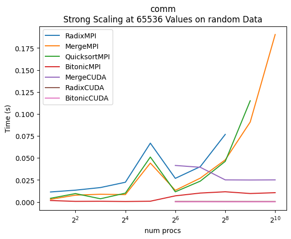
    
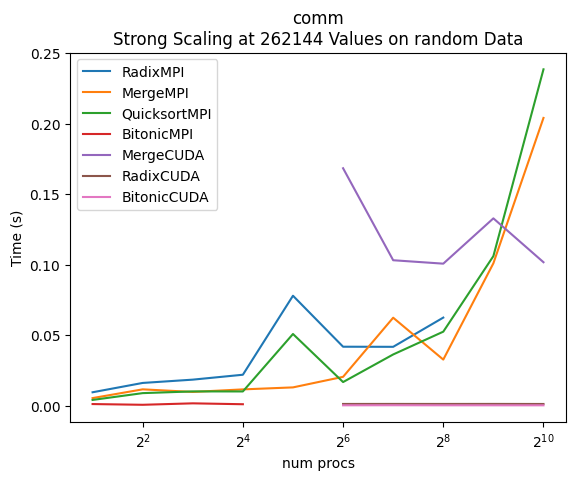
    
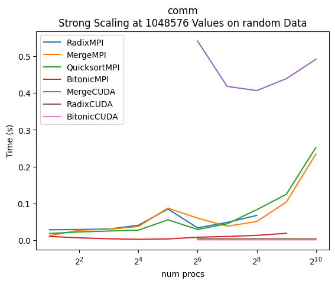
    
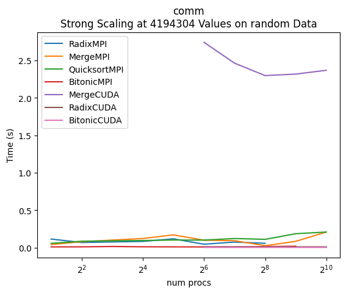
    
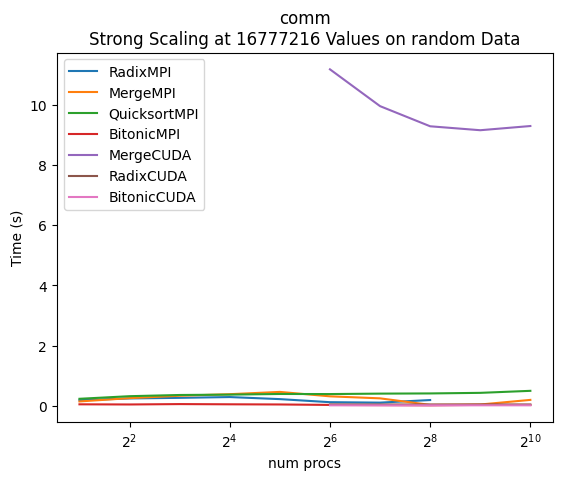
    
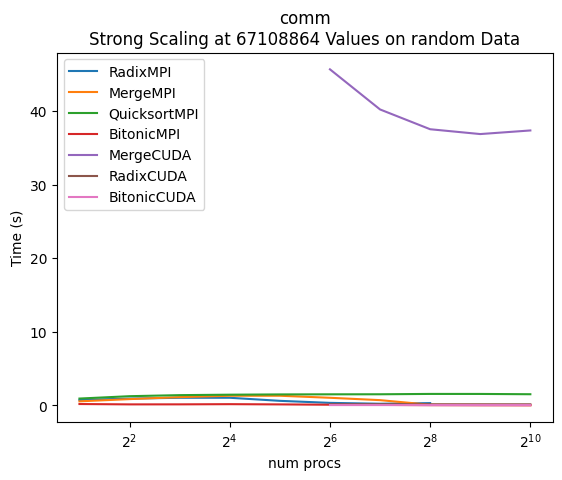
    
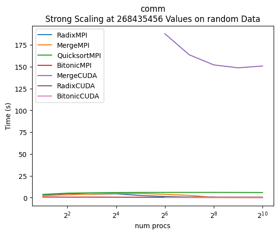


We observe that overall, the worst performer is MergeCUDA in regards to communication. This is then followed by QuicksortMPI and MergeMPI. The fastest performer is consistenlty MergeCUDA and BitonicCUDA. It is interesting that the MergeCUDA is so poor, indicating that it communicates a lot more throughout its code runtime than any other algorithm.

### Weak Scaling


We observe that MergeMPIRandom is the worst performer in regards to weak scaling. This is then followed by RadixMPI, BitonicMPI, and QuicksortMPI. Interestingly, although RadixMPIRandom is the 2nd worst performer for weak scaling at less processes, we see that when we increase the number of processes, it becomes a better weak scaler than all the other algorithms.


### Speedup


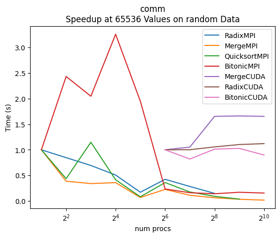
    
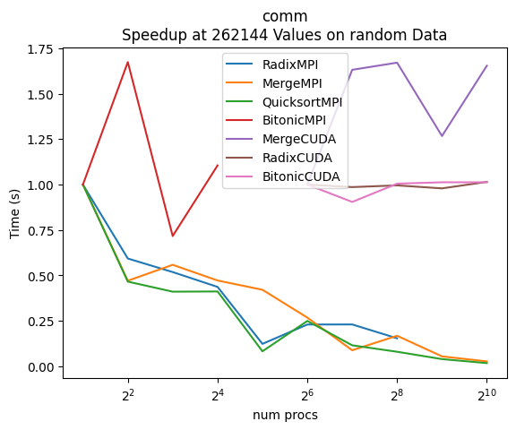
    
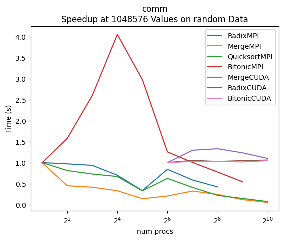
    
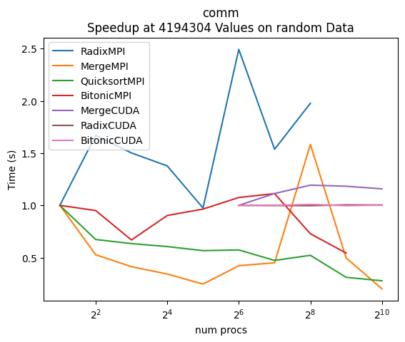
    
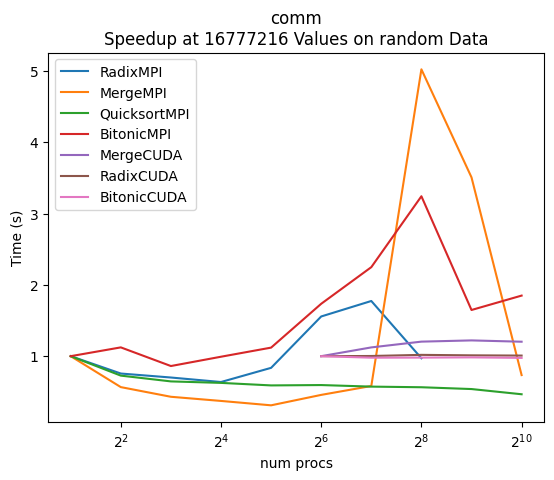
    
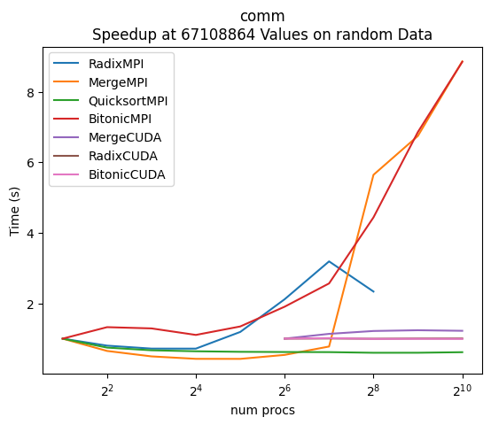
    
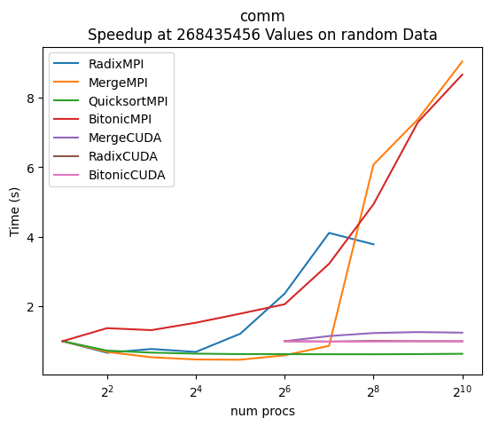
    

## Radix Sort Analysis and PerformanceEval/Plots

### MPI

#### Strong Scaling


We see that for Radix Sort, the Comparisons Strong Scale rather well. We do note that there are diminishing returns. Ideally, the graph should be a straight line down, as the number of processes are in log2 scale. We observe that from 2 to 4 processes gives us the most advantage as the slope is the steepest, indicating a pronounced acceleration in efficiency.

| RadixMPI Random | Strong Scaling MPI Reverse |
| --------------- | --------------- |
|     |  |
|  |  |


One interesting observation to note within strong scaling is the difference between the sorting of random values versus reverse values. Observe the first row, where we see that given an input of random values, the algorithm scales relatively well, especially for higher inputs. However, with an input of reverse input there is virtually no strong scaling observed.


Upon further investigation, we see that the culprit is the communication overhead. We see on the left with random input that as we increase the number of processes, the time trends downward. With reverse input, we observe that on increasing the number of processors, the time actually increases.
The reason for this phenomenon lies in the inner workings of my MPI Radix Sort. Within the code, each process is given a section of the array to sort. After each pass, where the algorithm sorts by 8 bits at a time, the processes communicate amongst each other to determine where in the array their numbers belong. If the process realizes that the value it "owns" belongs in another section of the array, it will communicate as such, and send it off to the process it belongs to. 

With reverse sorted output, we know that the values that a process "owns" will all have to be sent to another process. This results in each process having to both send and receive the entirety array that it owns. Thus, it is no surprise that with a reverse sorted input, the more processes we add, the more time it takes to communicate between processes, and the worse the overall runtime.

#### Weak Scaling

| Comp Large | Comm |
| --------------- | --------------- |
|  |   |

   With Random Input, we observe that both comp_large and comm weak scale quite well. Although the lines seem to trend upwards, we see that the y axis scale is quite small, and so we may consider both of these trends as practically straight lines, with comp large weak scaling the best.


#### Speedup

| Comp Large | Comm |
| --------------- | --------------- |
|  |  |

The speedup for comp_large is relatively decent. That is, we do see an upward trend, as we increase the number of processes. However, the speedup is not ideal by any means. We see that the highest speedup is achieved with an input of 2^22, where at 2^8 processors, we have a speedup of 120. Ideally, 2^8 processors would give us a speedup of 2^7. This is not so. One possible explanation is that as we increase the number of processors, there is just more overhead. Right before every processor prepares to receive values from other processors, each individual processor has to determine if it has enough space to receive x number of values. Thus, with more processors, more communication follows, meaning more computation as each processor takes more time to compute the size of the array it should be prepared to receive.

We also observe that communication has extremely poor speedup. In fact, we see a downward trend. This makes sense as we increase the number of processors, we increase the communication time, leading to poor and even negative speedup. 


### CUDA

#### Strong Scaling

| All Input Types | Random Input Type |
| --------------- | --------------- |
| |  |


 We observe the table on the left. We see that from worst to best performance based on input type is as follows: random, perturbed, sorted, reverse. Most surprising is the fact that reverse performed the best. I believe this may be due to the block shuffle that occurs. After each thread appropriately sorts its own block, there is a function that shuffles the block to its correct space. As the sorting algorithm looks at only 2 bits at a time, in a sorted input, a lot more shuffling may occur. 1, 2, … 10, 11, 12, … 20, … 40 would shuffle first to 1, 11, 21, … 2, 12, 22, … which involves much more unnecessary shuffling than if the input is in reverse order. In reverse order, although there is shuffling, the shuffling brings you closer to the sorted output, versus in sorted order, the shuffling brings you further away from sorted order. 

By observing just an input of 2^28, we see that after 2^7 threads, the overhead becomes too much, and we see a diminishing returns trend.


This exact same trend can be observed through comp_large. After 2^7 processors, the overhead becomes too large to give much benefit.


#### Weak Scaling

| Comp Large | Comm |
| --------------- | --------------- |
|  |  |


The CUDA Radix Sort implementation weak scales only moderately well, with the difference between 2^6 threads and 2^10 threads only benign about 0.5 for both comp_large and comm. This again, is due to all the shuffling needed between blocks as the number of threads increases.


#### Speedup

| Comp Large | Comm | Main |
| --------------- | --------------- | --------------- |
|  |  |  |


In the speedup, we see the same trend observed with strong scaling. That is, that the best speedup occurs from 2^6 to 2^7, followed by only diminishing returns. From 2^6 to 2^7 the speedup is only moderately good for comp_large, with the speedup resulting in 1.3, which is close to 2.The comm shows poor speedup, and the the main function demonstrates moderate speedup for 2^6 to 2^7 processors. Main is a poor measure as it includes data correction and input generation. Poor speedup in comm makes sense as the time to communicate will only increase rather than decrease as we add more threads.

## Mergesort Analysis and PerformanceEval/Plots

### Strong Scaling

I used the strong scaling PerformanceEval/Plots for the input size of 2^28 for my analysis. I wanted to look at the largest input size to get the best understanding of how well the algorithm scales.

#### MPI


By looking at the PerformanceEval/Plots for the comp_large region, we can see that there is certainly a decrease in time as the number of processors increases. Interestingly, the communication time seems to be increasing with the number of processors, but it then drops back down past 2^5 processors. I did notice that the communication overhead is the dominating factor in the runtime as the input size gets large and the number of processors gets large as well. Overall, the MPI mergesort algorithm seems to strong scale very well.

#### CUDA


My CUDA mergesort algorithm seems to be quite interesting. It seems to be running suspicously fast; on the largest input size, it seems to take a fraction of a second to sort everyting. All of my runs did pass the correctness check, but I still not sure if my code is working quite right. It just seems too fast to be true. With this very fast runtime, it does not seem to strong scale since it is already so fast. The runtime of my CUDA implementation is pretty much all communication between the GPU and the CPU. It is interesting to note that the communication time seems to decrease with the number of threads; I am not sure what would cause this kind of trend.

### Strong Scaling Speedup

I used the PerformanceEval/Plots for 1% perturbed for my analysis below. This was not for any particular reason as all the input types showed similar trends.

#### MPI


The MPI mergesort algorithm shows great speedup for the comp_large region. It actually seems that the computation still has lots of room to grow as it hasn't started plateauing; however, the speedup for the main region does show that the algorithm has reached its highest speedup of about 4.5 for the largest input size. This is because the main region includes input generation, computation, and correctness check. The correctness check and input generation are not non-parallel regions which causes the speedup to flatten out.

#### CUDA


The speedup for the CUDA version does not look very good. It hardly gets above 1 at some thread counts, but I don't think that this is the whole story. Since the algorithm is taking a fraction of a second already, it doesn't show any speedup. However, this doesn't really matter since it is already incredibly fast. I wonder if running on larger input sizes would cause it to take longer and show more of a speedup, but with the data I collected there isn't much to look at.

### Weak Scaling

For weak scaling, I again looked at the perturbed data PerformanceEval/Plots. This was not for any particular reason as all the input types showed similar trends.

#### MPI


The computation region weak scales very well as the plot is almost a perfect straight line. However, the communication and main regions do not weak scale at all. The main region shouldn't weak scale since it has to do more comparisons when running the correctness check and generates more data. It also makes sense that the communication region does not weak scale because it the amount of communication is directly tied to the size of the problem.

#### CUDA


For CUDA, the computation region weak scales very well but the main and comm regions do not. The main region acts the same as in MPI, and the amount of data being sent to/from the GPU increases with the problem size so it wouldn't weak scale either.

## Bitonic Sort PerformanceEval/Plots

This section will have all PerformanceEval/Plots for our Bitonic Sorting Algorithm, including both MPI and CUDA implementations for Random, Sorted, Reversed, and 1% Perturbed input types. The PerformanceEval/Plots are grouped by strong scaling, speedup, and weak scaling for Main, Comm, and Comp_Large Caliper regions.  

### Strong Scaling

#### MPI

For the MPI implementation, we see relatively the same trends across all input types. The only notable exception is random input type, which has a much higher time taken for smaller processor numbers. This can likely be explained by sorted, reversed, and 1% perturbed having a predictable trend which means swapping becomes easy - it's either already sorted or it just needs to be switched to the opposite side of the array, or only 1% of the array needs to be actually sorted. With random, however, there's no trend, and there's likely much more overhead that's created as a result of all the swapping and comparisons that happen.


On the lowest input sizes, we see a near exponential growth pattern in time taken as processor count increases, which can mostly be attributed to communication overheads caused by bringing a metaphorical gun to a knife fight - with too many processors and too little computations that need to be done, the waste communication time of sending empty work to a processor outweighed the benefits of parallelization.


On the largest input sizes, we see a near exponential decline in time taken as processor count increases, with increases in time taken at the highest processor count. This is likely because the input size was so large that there was meaningful work for all the processors to carry out meaning that the benefits of parallelization weren't eaten up by communication overheads. At the very end, the high processor count likely caused communication overheads to slightly eat into the benefits of parallelization, but with an even larger problem size, this would likely be mitigated and you would see a consistent decline in time taken with increasing processor count.

The comm times gradually increasing as input size increases corroborates this, as does the consistent, sharp decline of comp_large.  
    

    

    

    

    

    

    

    

    

    

    

    

    

    

    

    

    

    

    

    

    

    


#### CUDA

For CUDA, all input types behaved the same (mostly the same with negligible differences) across all input sizes, with no discernable trend until the input size of 67108864, at which point we see compute times measurably decrease on the main function across all input types. Both the comp_large and comm regions stay at very similar times throughout all input sizes, even when there did start to be a measurable decrease in time at the larger input sizes. This is likely due to GPUs being designed for high throughput with thousands of cores, data locality, and other facts. The scale should be closely examined for all CUDA PerformanceEval/Plots. It's also important to note that the runtime's biggest differential across all input types and sizes is just one second, from ~2.2 seconds to ~1.2 seconds at the largest inpiut size, showing the impressive benefits of using a GPU for complex computations like this. 

    

    

    

    

    

    

    

    

    

    

    

    

    

    

    

    

    

    

    

    

    

    


### Speedup

#### MPI

For MPI, we see that the main function's speedup has the same trend across all input types. However, the scale of the speedup changes dramatically with input type. Random input experienced the highest speedup at the higher processor counts, achieving up to around 9, with a drop off at 1024 processors. This is likely due to there being a much higher amount of computations that are needed ot sort a random array, which will benefit from more processors way more than mostly pattern sorted arrays like 1% perturbed, sorted, and reverse input types.  We also see that for smaller input sizes, the speedup is actually negative as processor numbers increase. The decrease in speedup at the highest levels for smaller input sizes, and at 1024 for the largest input size, is likely caused by increases in communication overheads, which stays constant in the begining despite exponentially increasing processor counts. Comp_Large exponentially increases across all input types, which further corroborates that slowdowns were likely caused by communication overheads. 
    

    

    

    

    

    

    

    

    

    

    

    

    


#### CUDA

Our CUDA implementation of bitonic sort had a much smaller differential than MPI, with a max speedup of 2. This can likely be explained by GPUs' nature being much more focused on parallelism, data locality, and much higher throughout. We don't believe the low speedup is due to the algorithm, as there is some speedup, and the comp_large and comm times stay largely flat across all input sizes. 
    

    

    

    

    

    

    

    

    

    

    

    

    


### Weak Scaling


#### MPI

For the MPI implementation on a weak scaling front, we see nearly identical, strong performance across all input types and processor numbers. All input types start at around a time of .5 and end at around 3.5 for the same problem size with more processors. Comm and Comp_Large weak scaling measures remain negligible, but with an upward trend, across all input types. 
    

    

    

    

    

    

    

    

    

    

    

    

    


#### CUDA

Our CUDA implementation had weaker weak scaling than our MPI implementation, which can likely be explained by the high levels of parallelism that GPUs have already, corroborated by very negligible comm and comp_large times across all input types.
    

    

    

    

    

    

    

    

    

    

    

    

    

## Quick Sort PerformanceEval/Plots

### Overall: 
There are a few disclaimers. My CUDA implementation was not able to achieve the problem sizes that we were initially given. As a result, I used problem sizes from $2^{10}$ to $2^{16}$, increasing in increments of powers of 2. For my MPI implementation, however, I was able to get everything working, so I used the problem sizes from $2^{16}$ to $2^{28}$, increasing in increments of powers of 2.


### Strong Scaling

#### Analysis:
**Strong scaling** is when you increase the number of processses, but keep the problem size the same. As you can see, this MPI implementation scales pretty well across all of the different kinds of inputs. Between problem sizes $2^{16}$ and $2^{20}$, you can see that time taken to run the entire algorithm actually increases with process size increase. It is only after $2^{22}$ that it actually decreases. This is due to the fact that it takes a lot more time to communicate between the higher process sizes and there is a lot of organizational overhead. It is only on large input sizes that the communication time is dwarfed by the actual computation time, so increased process size actually helps. The same behavior can be seen in the graphs measuring communication. The same explanation can be used for these graphs. The communication time is actually increasing with process size until the input size is large enough that the communication time is dwarfed by the computation time. However, something peculiar is seen in Comm. On random input types with large problem sizes, there is an inverted graph that is logarithmic in nature compared to the other graphs. I think that for smaller process counts in random inputs with large problem sizes, it takes a long time to communicate and merge chunks of data on small process sizes during the ```MPI_Send``` and ```MPI_Recv``` calls. However, as the process size increases, the communication time decreases. We can support these arguments by looking at the computation graphs, in which the computation time decreases with process size increase, which makes sense since without taking in communication time, the computation time should decrease with process size increase exponentially.

#### MPI

    


    

    


    

    


    

    


    

    


    

    


    

    


    

    


    

    


    

    


    

    


    

    


    

    


    

    


    

    


    

    


    

    


    

    


    

    


    

    


    

    

### CUDA

#### Analysis:
There are a few observations to make with this CUDA implementation. It takes much longer time on all thread counts to run the algorithm for reverse sorted input types, as well as communication and computation. This is because the pivot is always chosen to be the first element in the array, so if the array is reverse sorted, then the pivot will always be the largest element in the array. This means that the array will be split into two subarrays of size 1 and size n-1, which is the worst case for quicksort. This is why the reverse sorted input types take much longer to run. The random input types take the least amount of time to run, which makes sense since the pivot will be chosen randomly on random input, so the array will be split into two subarrays of size n/2 and n/2, which is the best case for quicksort. There are hills and valleys in communication times for all input times, with sorted input doing the worst in terms of communication. Brute computation seems to be pretty constant across all input types, however, I am not sure if this is a product of my earlier disclaimer that I was not able to get the CUDA implementation to work for large problem sizes without timing out.
    

    

    

    

    

    

    

    

    

    

    

    

    


### Strong Scaling Speedup

#### MPI

#### Analysis:
When measing **speedup**, we are measuring the improvement in parallelization versus time taken sequentially. For large input sizes in all input types for total runtime, we see a similar trend in speedup. There is an almost parabolic route with $2^{28}$, the largest input size, where there is the highest speedup. However, with smaller input sizes, we actually see a gradual decrease in speedup due to process organizational overhead. In brute computation time, we see exponentially increasing speedup as process count increases, which makes sense since as process count increases, computation time decreases. With communication, we see similar graphs to main in input types of 1% perturbed. However, for the other three input types we see a gradual decrease in speedup as process count increases, which makes sense because of the organizational overhead mentioned before.

    

    

    

    

    

    

    

    

    

    

    

    

    


#### CUDA


#### Analysis:
For the CUDA implementation, we actually see a few polar opposites from the MPI implementation. First of all, the speedup gradually decreases for all input types for entire runtime. This is because the CUDA implementation was not able to achieve the same problem sizes as the MPI implementation without taking a long time. For brute computation on random input types, speedup becomes 0 on any process count higher than 64. I believe that this is also because of the problem size limitation. For communication, the trends are almost identical to the graphs for the entire algorithm runtime. This is of organizational overhad, as mentioned before.


    

    

    

    

    

    

    

    

    

    

    

    


### Weak Scaling


#### MPI
#### Analysis:
When talking about **weak scaling**, we are talking about increasing the problem size and the process size proportionally. For the MPI implementation, we see that the total runtime increases exponentially with problem size increase when testing full algorithmic runtimes. Something to note is that on Random input types, the scale goes from 1-8 seconds, however for the other 3 input types, it goes from 0.5 to 3.0-3.5 seconds. With graphs measuring communication, we see a similar trend as well as similar scale differences. However, with the brute computation, we see a parabolic route. This is because until a certain point, the problem size is too large for the proportional increase in process size. There is a saddle point, however, where the problem size is large enough that the process size increase is proportional and we start to see a decrease in time. With 1% Perturbed, we see a linear decrease in time as problem size and process count increases. However, the scale is so small that we can consider these almost constant lines.
    

    

    

    

    

    

    

    

    

    

    

    

    


#### CUDA

#### Analysis:
With CUDA implementation, we see almost identical trends as the MPI implementation. However, the scale is much, much larger. This is because the CUDA implementation was not able to achieve the same problem sizes as the MPI implementation without timing out. We see the same trends as before though. We see a linear increase in time taken in both full algorithm runtime as well as communication. We do see a parabolic graph in brute computational time, but it is an inverted parabola. For Random and Reverse-Sorted. However, with Sorted and 1% Perturbed, we see a linear increase and a somewhat zig-zag shape. However, due to the difference in scale being so small, we can consider these constant lines as well.


    

    

    

    

    

    

    

    

    

    

    

    

